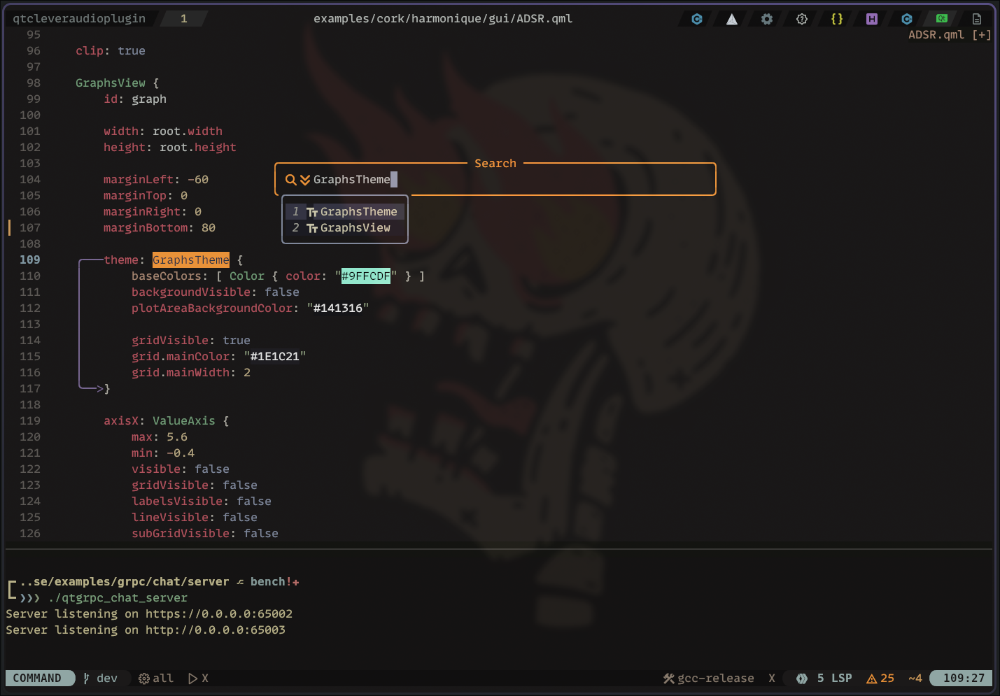

# nvim

My handcrafted and personalized nvim config that I use across all machines.

<div align="center" width="100%">
    
</div>

Dependent packages:

```bash
    yay -S --needed neovim-remote ripgrep fd tree-sitter cargo npm wget luarocks sqlite
```
